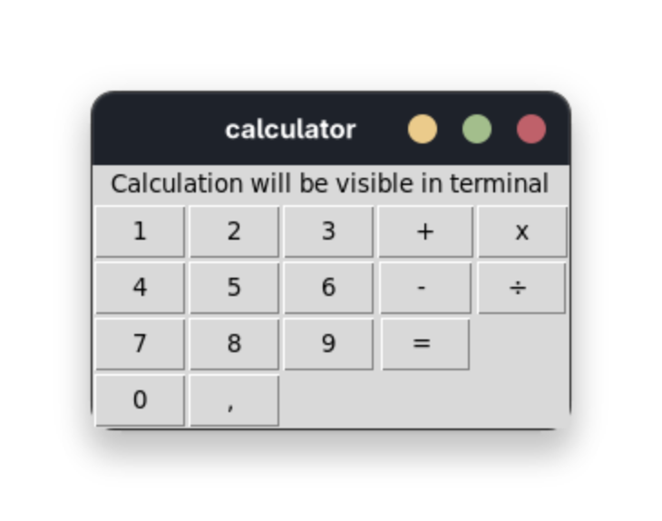

# Simple calculator written in python using **tkinter** library

I used **tkinter** to build a GUI for my calculator. It's a very simple calculator and my first project. 

- it uses eval for calculations
- it also uses try and except for **ZeroDivisionError**
- GUI has only buttons and label, "screen" of calculator, output is in terminal and visible **only after "=" button is pressed**

 

 

